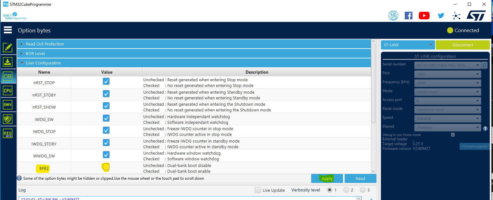

# STM32-Hotspot/Dual-Bank Firmware Update on NUCLEO-L476

## Example

This Hotspot FW package includes:
* Application for performing live firmware update utilizing Dual Bank Flash architecture      
  * Non-Blocking implementation allows application to run during update process
  * Companion script for loading application binary, availabe as an executable with no dependencies or as a python script.
  * Companion script communicates with NUCLEO through STLINK virtual COM port.

## Board Needed

  * [NUCLEO-L476](https://www.st.com/en/evaluation-tools/nucleo-l476rg.html)

## Users Guide

### Preparing Dual-Bank Firmware Update (DBFU) application on MCU
  * Connect the NUCLEO to a PC using a USB cable
  * Open the project in STM32CubeIDE
  * Build the project.
  * Using STM32CubeProgrammer, ensure the the BFB2 bit in the option bytes is unchecked 
    
    * **PLEASE NOTE**: You can also leave the BFB2 bit checked, but in this case, you will need to manually load the binary DBFU_L476.bin found in the Debug folder at address 0x8080000 (address of bank 2). If you attempt to program the board through CubeIDE while BFB = 1, the application will not run, since the CubeIDE .elf file is targeting address 0x8000000 per the linker file.
  * Load the firmware into target memory.

### Python Script Info and Dependencies

  * Within the project directory, you will find a folder call Loader_Script
  * This folder contains a python script DBFU.py and an executable DBFU.exe
  * The executable is a precompiled version of the script that should work as is without needing to worry about dependencies
  * If you want to run the python script yourself, it has three dependencies:
    * [crc](https://pypi.org/project/crc/)
    * [pyserial](https://pypi.org/project/pyserial/)
    * [tqdm](https://pypi.org/project/tqdm/)
  * **PLEASE NOTE**: Script was written in Python 3.11.1 and compiled on a Windows 10 system. The precompiled executable will only work on Windows systems. If you would like to use it on other operating systems, it will be necessary to resolve the dependencies and ensure functionality on your system.

### DBFU process

This application implements a simple non-blocking LED blink in the main while loop. The frequency of the blinking is different depending on which bank you are booted into. If in Bank 1, it toggles at 0.5Hz. If in Bank 2, it toggles at 5Hz. By pressing the Blue push button B1 on the NUCLEO board, the bootloader process is initiated. If the loader script isn't running and/or not ready to start the firmware update process, the led will blink quickly 10 times indicating that the initiation of the firmware update process was unsuccessful, at which point it will wait once again to start the process.

Here is a step-by-step for performing the firmware update:
  * Ensure that the NUCLEO board is running the firmware and connected to the computer via USB. You should see the LED on the board blinking
  * Run the loader script executable DBFU.exe found in the folder Loader_Script in the project directory, or if you have python and the necessary dependencies, you can run the python file
  * The script will prompt you to "Enter a path to a binary: ". This can be a relative or absolute path. A CubeIDE postbuild command has already copied the binary to the Loader_Script folder, so you can simply type DBFU_L476.bin
  * Script will indicate that it is "Waiting for device to initiate update...". Press the blue button B1 on the NUCLEO board.
  * This will initiate the transfer. You should see a progress bar indicating the progress of transfer. 
  * **PLEASE NOTE**: You should see that the LED continues to blink at the same rate during the transfer process. This is to show that in an actual application, your firmware can still perform its main tasks during the firmware update process. If these main tasks take a while, they will slow down the     firmware update process. Also, if these main tasks are interrupt driven, some care may be needed to tune the NVIC priorities, as the DBFU process also uses interrupts.
  * Once the transfer is completed, the firmware will automatically switch banks.
  * You should see the LED blink at a different rate than before, indicating that the MCU is successfully running the firmware that was just flashed into the other bank.
  * This can be repeated at infinitum.

## Troubleshooting

**Caution** : Issues and the pull-requests are **not supported** to submit problems or suggestions related to the software delivered in this repository. The DBFU_L476 example is being delivered as-is, and not necessarily supported by ST.

**For any other question** related to the product, the hardware performance or characteristics, the tools, the environment, you can submit it to the **ST Community** on the STM32 MCUs related [page](https://community.st.com/s/topic/0TO0X000000BSqSWAW/stm32-mcus).